# Macroeconomic Transmission: Euro Area vs USA
**Project Status:** WORK IN PROGRESS  

## References/Inspo
* [ECB Press Release (Sept 2023)](https://www.ecb.europa.eu/press/key/date/2023/html/ecb.sp230925_1_annex~ffad9c5321.en.pdf)
* [ECB Working Paper 749](https://www.ecb.europa.eu/pub/pdf/scpwps/ecbwp749.pdf)
* [BIS Speech (Jan 2024)](https://www.bis.org/speeches/sp240124.pdf)
* [BIS Bulletin 67](https://www.bis.org/publ/bisbull67.pdf)
* [ECB Working Paper 1320](https://www.ecb.europa.eu/pub/pdf/scpwps/ecbwp1320.pdf)
* [Advances in Short-Term Forecasting (Beyeler & Kaufmann, 2017)](https://www.ecb.europa.eu/press/conferences/shared/pdf/20170929_advances_in_short_term_forecasting/Paper_4_Beyeler_Kaufmann.pdf)

## Theoretical Framework & Proxies

### 1. Fiscal Policy Proxy (FISC)
To capture the net fiscal support provided to the economy (e.g., subsidies, tax cuts), the fiscal proxy is defined as the log-difference of the Disposable Income to Real GDP ratio:
$$\text{FISC}_t = \Delta \ln\left(\frac{\text{Disposable Income}_t}{\text{GDP}_t}\right) \times 100$$

**Methodological Note on the Fiscal Proxy (FISC):** Regarding the theoretical design of the model, it is worth noting the specific rationale behind the fiscal proxy. The variable was explicitly structured to capture the unprecedented macroeconomic anomalies of the pandemic and post-pandemic periods. Specifically, it aims to measure the friction between the artificial compression of economic activity (lockdown-induced halts in consumption and production) and the simultaneous public interventions designed to maintain household incomes and wage levels (e.g., furlough schemes and stimulus checks). By analyzing the ratio between disposable income and real GDP, the proxy attempts to quantify this exact imbalance: a government-sustained purchasing power operating within a constrained macroeconomic environment.

### 2. Monetary Policy Proxies
Despite central bank independence, massive asset purchase programs (QE) have heavily influenced the monetary base. Drawing directly on recent analytical frameworks from the Bank for International Settlements (e.g., Borio et al., BIS Bulletin 67), Excess Broad Money Growth is formalized as:
$$\text{EGM}_t = \Delta \ln(M3_t) - \Delta \ln(\text{Real GDP}_t)$$

Additionally, the Short-Term Rate (`IRT3M` / 3-Month Euribor) is employed as the conventional monetary policy instrument to avoid abrupt jumps present in the Deposit Facility Rate.

## Identification Strategy

### Current Approach: Cholesky Decomposition
The current baseline employs a recursive Cholesky ordering:  
`OIL -> GDPreal -> UR -> HICP -> FISC -> EGM -> IRT3M`  
This assumes sluggish reactions from macroeconomic aggregates to contemporary policy decisions. While effective, it suffers from potential linear biases, particularly concerning the 2020-2022 policy anomalies (e.g., the Price Puzzle in USA data).

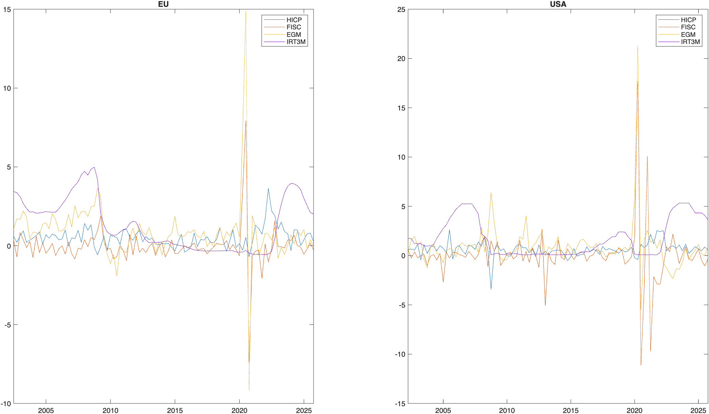

#### IRFs period: 2002q2-2025q3
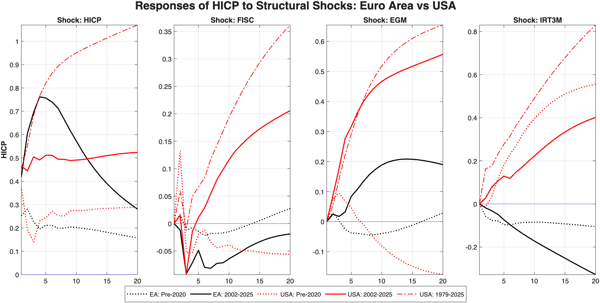

#### FEVD EA and USA
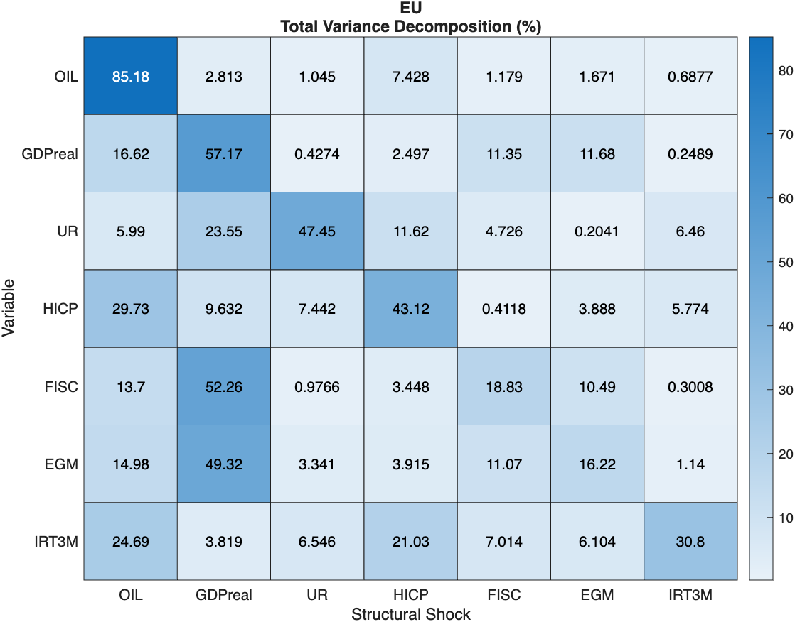
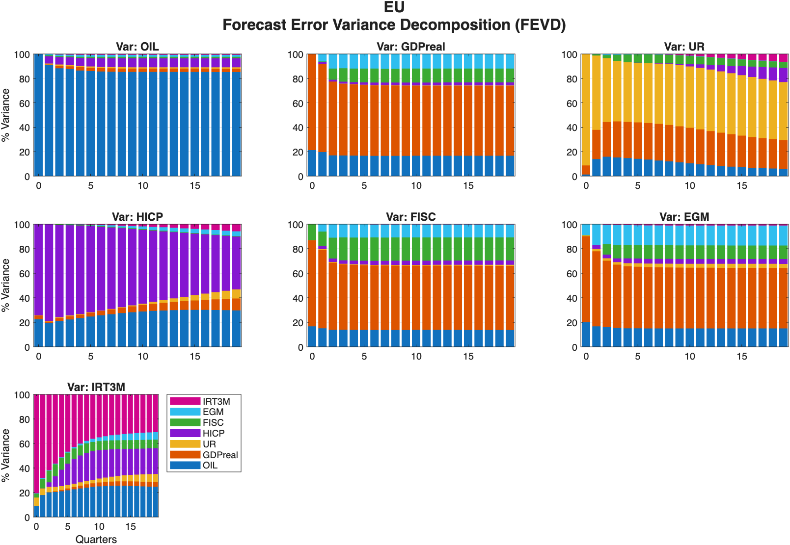
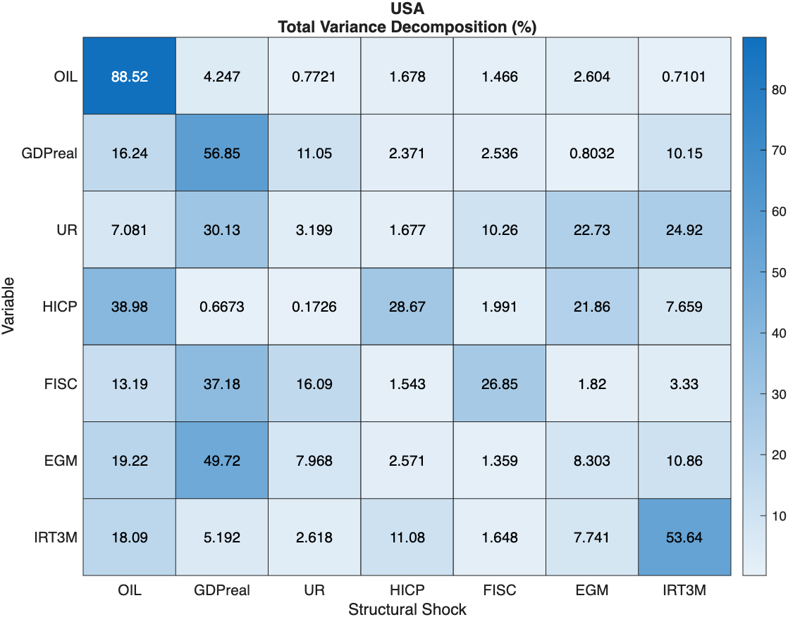
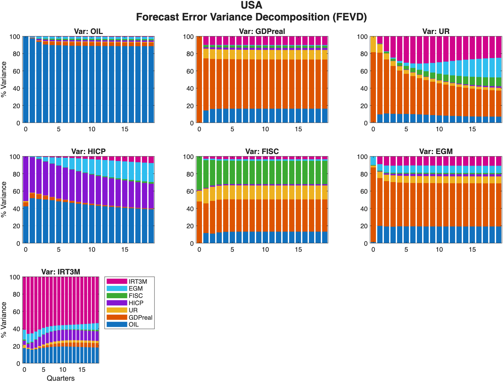

*Note: Preliminary estimates based on a 7-variable VAR model. Variables ordered as: OIL, GDPreal, UR, HICP, FISC, EGM, IRT3M).*

The preliminary Forecast Error Variance Decomposition (FEVD) highlights notable structural differences in the drivers of inflation (HICP) between the Euro Area and the United States over the observed sample.

**Euro Area Inflation Dynamics:** In the Euro Area model, HICP variance appears to be predominantly driven by its own historical inertia (~43%) and external supply-side shocks captured by the OIL proxy (~30%). The direct contribution of domestic policy proxies-both fiscal (FISC, ~0.4%) and monetary (EGM, ~3.9%)-appears marginal. This suggests that, within this specific model formulation, European inflation behaves largely as an exogenous, supply-driven phenomenon with limited direct transmission from the modeled aggregate policy variables.

**United States Inflation Dynamics:** Conversely, the US decomposition points to a structurally different environment. While energy and commodity shocks remain a primary driver (~39%), the monetary/liquidity proxy (EGM) accounts for a substantially larger share of inflation variance (~22%). This indicates a potentially stronger and more direct demand-side transmission channel in the US compared to the Euro Area. Interestingly, the isolated fiscal proxy (FISC) explains a relatively low share of HICP variance in both regions (~2% in the US), although its effects might be partially absorbed by the monetary proxy (EGM) depending on the degree of debt monetization.

**Cross-Border Spillovers and Interconnectedness:** When evaluating these results, it is important to consider that the two models are estimated independently and do not explicitly capture international spillovers. Anyway it is possibile the presence of some spillover effect not measured in this work.

**Critical Assessment and Methodological Caveats:** While the variance decomposition yields economically intuitive results, a rigorous econometric caveat must be stated regarding the fiscal proxy (FISC). The marginal contribution of FISC to inflation variance is subject to a dual interpretation. Economically, it may accurately capture the non-inflationary, "shielding" nature of recent fiscal interventions, which were absorbed by energy bills rather than translating into aggregate demand. However, from a strictly methodological standpoint, the hypothesis that the proxy itself might be sub-optimal or too noisy to isolate the true inflationary fiscal impulse cannot be ruled out. Confounding factors such as the unprecedented accumulation of "excess savings" by households during lockdowns may have severed the immediate transmission channel between fiscal transfers (disposable income) and consumption. In sharp contrast, the monetary proxy (EGM) demonstrates remarkably robust explanatory power for the US.

## UPdate 30/04: Possibile Economic Interpretation: fiscal and monetary impact USA vs EA: EX-POST

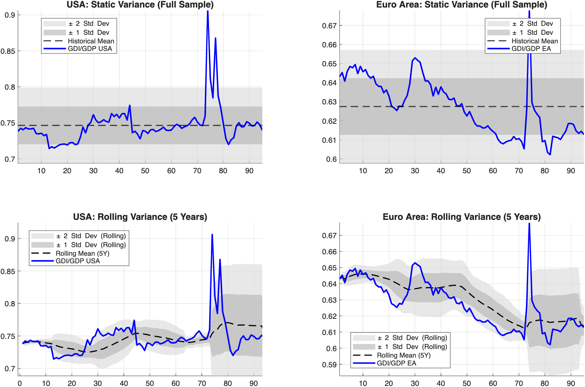

|Anomalies (Z-SCORE)| value |
|-----------|---|
|USA Peak Z-Score (Static)| 6.09 std dev|
|EA Peak Z-Score  (Static)| 3.39 std dev|
|USA Peak Z-Score (Rolling)| 26.47 std dev|
|EA Peak Z-Score  (Rolling)| 13.44 std dev|

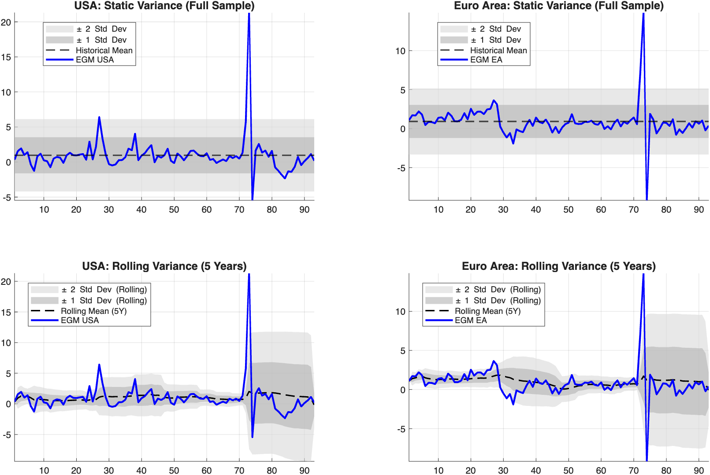

|Anomalies (Z-SCORE)| value |
|-----------|---|
|USA Peak Z-Score (Static)| 7.88 std dev|
|EA Peak Z-Score  (Static)|6.57 std dev|
|USA Peak Z-Score (Rolling)| 16.47 std dev|
|EA Peak Z-Score  (Rolling)| 9.29 std dev|

1. **Data Investigation & Z-Score Analysis**
To trace the origin of the structural divergence captured by the VAR model, the proxies were inspected against their historical volatility. Visual evidence highlights a severe magnitude mismatch during the Q2-2020 shock. To formalize this, peak anomaly scores (Z-scores) were computed relative to both a static full-sample variance and a 5-year rolling variance, effectively controlling for heteroskedasticity.

2. **Reconciling IRFs and FEVD (The US Fiscal-Monetary trigger)**
Although US IRFs show a clear positive HICP response to fiscal shocks (unlike the EA), the FEVD assigns only ~2% of inflation variance directly to FISC. 

This could be a contradiction, my interpetation is that the fiscal shock acted merely as a trigger. 
The resulting debt monetization—captured by excess broad money 
(EGM, explaining ~22% of variance)—acted as the primary transmission mechanism to the real economy.

3. **The Euro Area "Transmission Failure" (Excess Savings)**
Both regions saw massive expansions in EGM. However, the FEVD reveals a weak impact in Europe (~3.9% impact on HICP vs. ~22% in the US). 
A likely driver for this divergence is that the European monetary overhang remained trapped as precautionary
 "excess savings", dropping money velocity. In contrast, US consumers showed a higher marginal 
propensity to consume, directly translating liquidity into aggregate demand.

[Gross saving of households, ratio of adjusted gross disposable income, Euro area 20, Quarterly](https://data.ecb.europa.eu/data/datasets/QSA/QSA.Q.N.I9.W0.S1M.S1._Z.B.B8G._Z._Z._Z.XDC_R_B6GA_CY._T.S.V.C4._T)

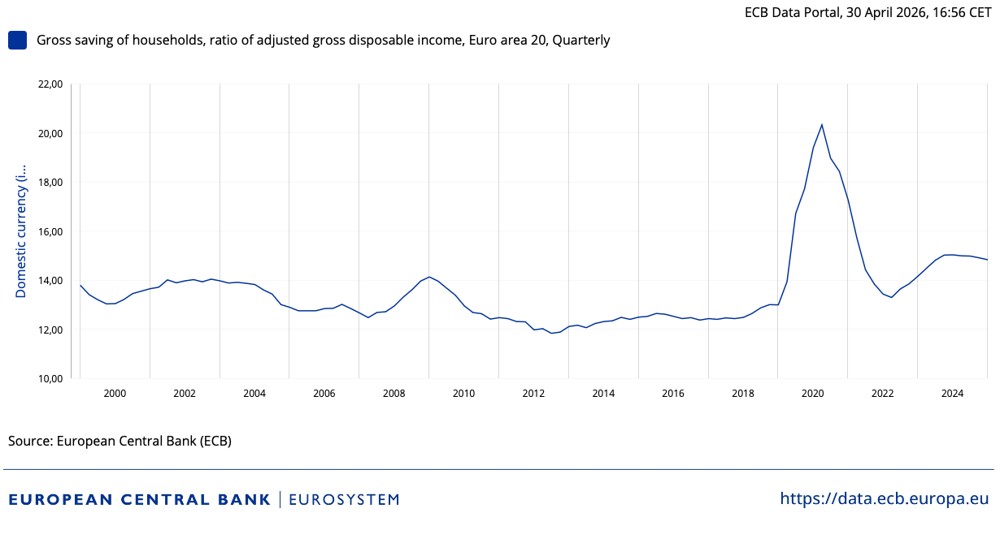
#### Personal Consumption Expenditures (PCE)
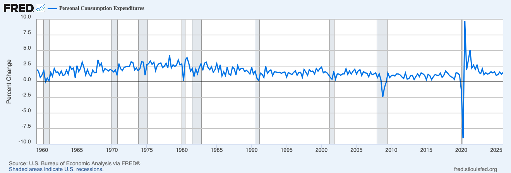
#### Private final consumption, Euro area 20, Quarterly
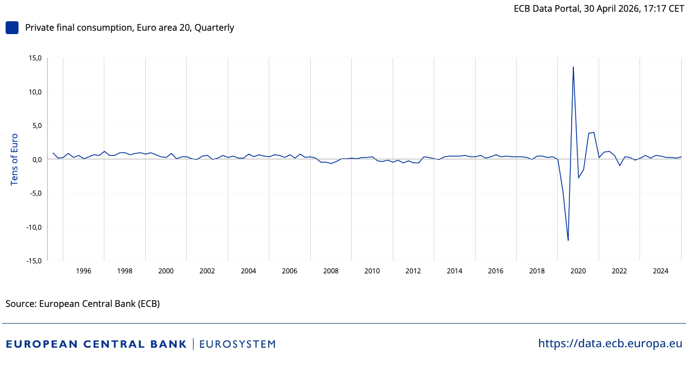

4. **Post-Peak Monetary Contraction**
The post-peak trajectory of EGM further reinforces this divergence. While base effects and policy tightening caused negative money growth globally, the contraction was asymmetric. The US proxy retreated to a moderate contraction (~ -5 std dev), whereas the Euro Area experienced a much sharper liquidity drain (~ -10 std dev). This aggressive European contraction likely closed the time window for the monetary overhang to fuel sustained demand-pull inflation.

5. **Model Limitations & Future Research**
Under the current VAR specification, money velocity and savings behavior are unobserved variables, making the above narrative a hypothesis derived ex-post. Formally testing this channel requires expanding the model to explicitly include proxies for household savings rates. Future iterations will focus on empirically verifying this asymmetric consumer behavior across the two jurisdictions.

**Links**
* https://ec.europa.eu/eurostat/web/products-euro-indicators/w/2-28042026-ap
* https://data.ecb.europa.eu/data/datasets/MNA/MNA.Q.Y.I9.W0.S1M.S1.D.P31._Z._Z._T.EUR.LR.G1
* https://fred.stlouisfed.org/series/PCE

## Next Steps & Robustness
1. **Sign Restrictions:** Compare mixed/contrast policies.
2. **Time-Varying Parameter VAR (TVP-VAR):** Given the structural breaks (e.g., Euro Area Great Moderation vs Post-COVID inflation), constant parameters might underestimate policy transmission. TVP-VAR integration is planned.
3. **BEAR ECB Tool Integration:** For robust Bayesian estimation, conditional forecasting, and formal sign restrictions.
4. **Machine Learning Forecasting:** Exploring non-linear algorithms for out-of-sample inflation forecasting.
5. **Codebase Standardization:** Refactor and translate all legacy inline comments from Italian to English.
